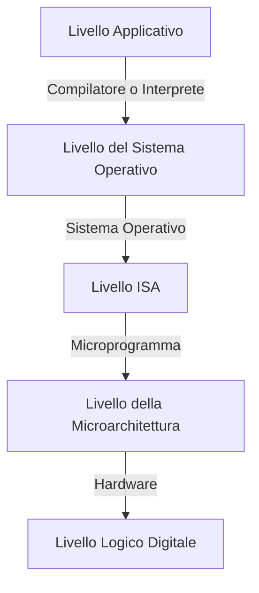

## `20/02/2024`

Il software richiede un apposito hardware per essere eseguito, viceversa l’hardware è pressoché inutile se non si dispone di un apposito software che ne sfrutti le potenzialità per risolvere problemi. 

**Linguaggio macchina ($L0$)**: insieme di istruzioni che l'hardware è in grado di eseguire
- Solitamente molto limitato
- Poco adatto per i programmatori

**Macchine a più livelli**: Dato che scrivere programmi in linguaggio macchina $L0$, entra in gioco il concetto di macchina a più livelli:
- Viene creato un nuovo linguaggio, un nuovo **livello** $L1$, più facile da utilizzare, che opera su un insieme di istruzioni eseguibili da un computer virtuale
	- Il *computer virtuale* in grado di "tradurre" il programma da livello $L1$ a $L0$
- Questa operazione si può ripetere diverse volte 

**Compilazione**: 
- Il codice viene "inviato" ad un traduttore (*compilatore/assemblatore*) che avrà il compito di tradurre il programma in linguaggio macchina-`i` e produce un nuovo programma in un linguaggio macchina più basso
- Traduco, salvo ed eseguo in un secondo momento

**Interpretazione**
- Il traduttore (*interprete*) legge il programma in linguaggio macchina-`i`, il programma verrà eseguita direttamente, il suo compito sarà quello di compilare (o "tradurre") riga per riga durante l'esecuzione (**run time**)
- Traduco man mano che eseguo

Livello Applicativo -> Linguaggio di programmazione (**C, basic, etc...**)
Livello OS -> Istruzioni Assembler + primitive dell'OS
- Livello di astrazione simile a quello del livello macchina
Livello ISA -> Esegue il linguaggio assembler del calcolatore
- Instrucition Set  Architecture
- Il livello isa è l'insieme di istruzione che l'hardware accetta
- **Instruction Set**:insieme di istruzioni presenti a questo livello

**Linker**
- Collega i moduli e risolve i riferimenti inter-modulo
- Serve per ottenere una unica sequenza di byte, un unico file eseguibile (su windows è il `.exe`)

**Microprogrammazione**
- Avere hardware capace di gestire istruzioni più complesse
- Ad un certo punto della storia si stava abusando di questa capacità e le macchine diventarono sempre più lente
	- Creata una nuova architettura che elimina completamente questo livello
		- RISC

**Vritualizzazione**
- Virtualizzazione dell'hardware per poter ospitare sistemi operativi diversi
	- Si creano 2 elementi
		- OS ospite (guest)
		- OS ospitante (host)
- Macchine virtuali per rendere il software portabile
	- Codice sorgente 

# Blazor

## `21/02/2024`

### Unità di Misura e prefissi
| Prefissi | Unità |
| ---- | ---- |
| Yotta |  |
| Zetta |  |
| Exa |  |
| Peta |  |
| Tera |  |
| Giga |  |
| Mega |  |
| Kilo |  |
| Milli |  |
| Micro |  |
| Nano Pico |  |
| Femto |  |
| Atto |  |
| Zepto |  |
| Yocto |  |
#### Prefissi Binari
- Da kilo a yottabyte

### Rappresentazione digitale dell'Informazione
#### I sistemi Digitali
>[!info] Segnale analogico
>Un segnale Analogico quando i valori utili che lo rappresentano sono continui (*infiniti*) in un intervallo e non numerabili

>[!info] Segnale digitale
>Un segnale è digitale quando i valori utili che lo rappresentano sono discreti e finiti
>I calcolatori moderni utilizzano due stati logici (binari)

#### L'aritmetica dei Calcolatori
DIversa da quella comunemente usata dalle persone

>[!tip] La Precisione

La precisione è con un numero finito di cifre

Le operazioni con i numeri a precisione finita causano errori ogniqualvolta il loro risultato non apprtiene all'insieme dei valori rappresentabili

>[!error] Underflow

>[!error] Overflow

>[!error] Non appartenenza all'insieme

- Le proprietà delle operazioni comunemente conosciute non sono sempre vere
	- Proprietà associativa
	- Proprietà distributiva

### Sistema posizionale
Sistemi posizionali utilizzati
- Sistema decimale
- Sistema binario
- Sistema ottale
- Sistema Esadecimale

### Byte
- I byte sono composti da 8 bit
	- Nel byte il bit più a destra è detto il bit meno significativo
	- Quello a sinistra è detto il bit puìiù significativo

Sequenze più lunghe di byte (16/32,etc) sono chiamate **WORD**

Intervallo di interi positivi rappresentabili con $n$ bit:
- 1 bit
- 8 bit
- 16 bit
- 32 bit
- 64 bit

Intervallo di interi positivi e negativi rappresentabili con $n$ bit
- Rappresentazione Ideale:
	- Una sola rappresentazione per lo $0$
	- Lo stesso insieme di valori positivi e negativi rappresentabili
- Entrambi le proprietà sono impossibili da ottenere insieme

#### Modalità di rappresentazione negativi
>[!tip] Grandezza e segno

Con questa rappresentazione il bit più significativo viene utilizzato per il segno
- Con zero si indicano i valori positivi
- Con 1 si rappresentano i valori negativi

>[!bug] Problema: doppia rappresentazione dello $0$

>[!tip] Complemento a due

Con questa rappresentazione il bit più significativo viene comunque usato per il segno
Codifica a due passaggi:
1. Negare tutti i bit
	1. `0101`$\to$ `1010`
2. Si aggiunge uno al risultato
	1. `1010 + 0001 = 1011`

In caso di riporto nella ottava cifra, non è necessario aggiungere la nona cifra, basta ignorare l'ultimo riporto.

I numeri positivi sono rappresentati esattamente nello stesso modo, mentre per i numeri negativi bisogna ripetere i passaggi usati nella conversione
1. `1011`$\to$`0100`
2. `0100 + 0001 = 0101`

Pro
- Unica rappresentazione dello $0$
- I numeri positivi sono codificati nello stesso modo di prima
- La sottrazione è eseguibile semplicemente sommando il numero con il numero in complemento a $2$
##### Operazioni in colonna con complemento a due

Il riporto generato dai bit più a sinistra, esso viene ignorato
- Se gli addendi sono di segno opposto non si può verificare un *overflow*
- L'overflow si verifica se gli ultimi due riporti nel fare la somma sono diversi fra di loro
-  Gli ultimi due riporti sono i " segnalatori di overflow"
>[!tip] Eccesso $2^{m-1}$

Consente di rappresentare i numeri come somma di se stessi con $2^{m-1}$ dove $m$ è il numero di bit  utilizzati per rappresentare il valore
- Si noti che il sistema è identico al complemento a due con il bit di segno invertito
- Per rappresentare il numero in eccesso $2^{m-1}$ basta sommare al numero il numero massimo rappresentabile con $m-1$ bit 
	- `0100` $\to$ 4 bit
	- `0100 + 0111 = 1011`
- Visualizzandolo nella retta dei numeri naturali sarebbe come "spostare" il minimo e il massimo numero rappresentabile a sinistra dell'unità massima rappresentabile $-1$ ($2^{m-1}$)

Anche in questa codifica è possibile fare la sottrazione come addizione di un numero con l'altro numero codificato in eccesso $2^{m-1}$

