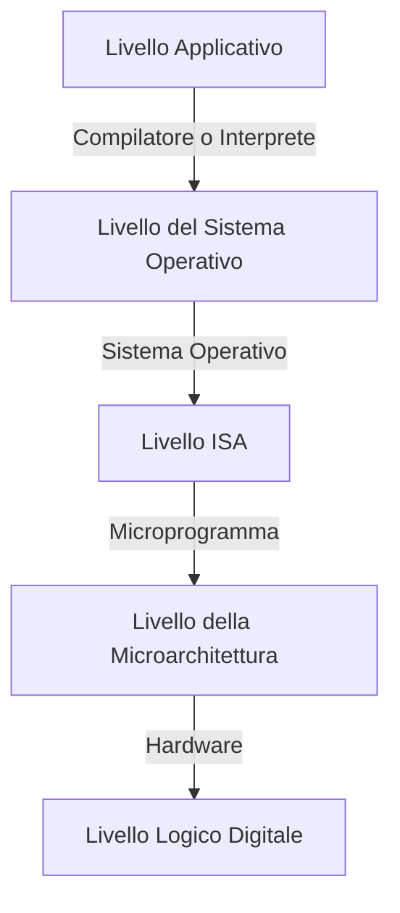

## `20/02/2024`
**Hardware**:
- indica l’insieme dei dispositivi che compongono il calcolatore. L’hardware si compone di oggetti tangibili: circuiti integrati, memorie, stampanti, ecc.
**Software**:
- indica l’insieme delle istruzioni e delle informazioni necessarie per risolvere i problemi a cui il sistema è preposto. Un insieme di istruzioni, codificate in termini comprensibili a un calcolatore, sufficienti a risolvere un problema viene detto programma. 

Il software richiede un apposito hardware per essere eseguito, viceversa l’hardware è pressoché inutile se non si dispone di un apposito software che ne sfrutti le potenzialità per risolvere problemi. 

Programmare un calcolatore significa scrivere la sequenza di istruzioni (algoritmo) necessaria a risolvere un problema. 

**Firmware**:
- software integrato in un componente elettronico (es. chip) o dispositivo (es. smartphone), in grado (almeno) di avviare il componente stesso e di farlo interagire con altri componenti.

**Linguaggio macchina ($L0$)**: insieme di istruzioni che l'hardware è in grado di eseguire
- Solitamente molto limitato
- Poco adatto per i programmatori

**Macchine a più livelli**: Dato che scrivere programmi in linguaggio macchina $L0$, entra in gioco il concetto di macchina a più livelli:
- Viene creato un nuovo linguaggio, un nuovo **livello** $L1$, più facile da utilizzare, che opera su un insieme di istruzioni eseguibili da un computer virtuale
	- Il *computer virtuale* in grado di "tradurre" il programma da livello $L1$ a $L0$
- Questa operazione si può ripetere diverse volte 

**Compilazione**: 
- Il codice viene "inviato" ad un traduttore (*compilatore/assemblatore*) che avrà il compito di tradurre il programma in linguaggio macchina-`i` e produce un nuovo programma in un linguaggio macchina più basso
- Traduco, salvo ed eseguo in un secondo momento

**Interpretazione**
- Il traduttore (*interprete*) legge il programma in linguaggio macchina-`i`, il programma verrà eseguita direttamente, il suo compito sarà quello di compilare (o "tradurre") riga per riga durante l'esecuzione (**run time**)
- Traduco man mano che eseguo

Livello Applicativo -> Linguaggio di programmazione (**C, basic, etc...**)
Livello OS -> Istruzioni Assembler + primitive dell'OS
- Livello di astrazione simile a quello del livello macchina
Livello ISA -> Esegue il linguaggio assembler del calcolatore
- Instrucition Set  Architecture
- Il livello isa è l'insieme di istruzione che l'hardware accetta
- **Instruction Set**:insieme di istruzioni presenti a questo livello

**Linker**
- Collega i moduli e risolve i riferimenti inter-modulo
- Serve per ottenere una unica sequenza di byte, un unico file eseguibile (su windows è il `.exe`)

**Microprogrammazione**
- Avere hardware capace di gestire istruzioni più complesse
- Ad un certo punto della storia si stava abusando di questa capacità e le macchine diventarono sempre più lente
	- Creata una nuova architettura che elimina completamente questo livello
		- RISC

**Vritualizzazione**
- Virtualizzazione dell'hardware per poter ospitare sistemi operativi diversi
	- Si creano 2 elementi
		- OS ospite (guest)
		- OS ospitante (host)
- Macchine virtuali per rendere il software portabile
	- Codice sorgente 

# Blazor