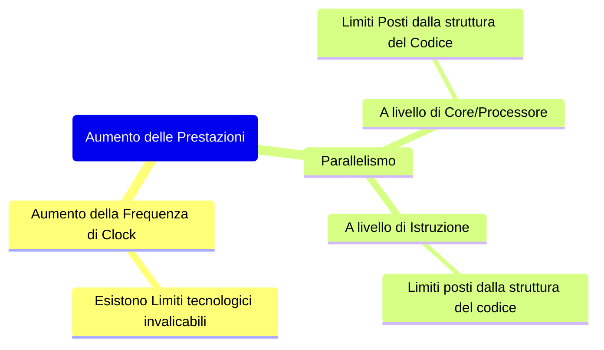

>*La velocità di esecuzione di una istruzione all'interno della [[La CPU|CPU]] determina in larga misura la velocità della `CPU` ed è sempre oggetto di discussione tra due correnti di pensiero*

## CISC
---
>[!info] *C*omplex *I*nstruction *S*et *C*omputer
>L'architettura `CISC` è un tipo di ***design*** per processori che include un ***insieme vasto*** di ***istruzioni macchina***
>>[!abstract] Istruzioni
>>Le istruzioni possono ***variare in lunghezza***, da 1-2 `BYTE` a decine di `BYTE`
>>Le istruzioni possono ***variare in tempo di esecuzione***, da semplici operazioni che usano ***1-2 cicli di [[La CPU#Data Path|data path]]***, a istruzioni molto complesse che occupano la `CPU` per ***diversi cicli di data path*** (*30-40*)
## RISC
---
>[!info] *R*educed *I*nstruction *S*et *C*omputer
>L'architettura `RISC` è un tipo di ***design*** per processori che include un ***insieme ristretto*** di ***istruzioni macchina***
>>[!abstract] Istruzioni
>>Le istruzioni hanno circa tutte la ***stessa lunghezza***
>>Le istruzioni vengono eseguite in pochi cicli di [[La CPU#Data Path|data path]]
>
>Saranno necessarie più istruzioni `RISC` per farne una `CISC` ma il sistema risulterà comunque più veloce poiché non sarà necessario ***interpretare le istruzioni***

### Principi di Progettazione RISC
>*Tutte le istruzioni del livello [[Il Livello ISA|ISA]] vengono eseguite direttamente dall'hardware*

>[!abstract] L'unità di controllo all'interno della `CPU` è ***cablata*** 

La `CPU` è realizzata con un [[Circuiti Sequenziali#|circuito digitale sequenziale]]
- Una ***macchina a stati***

>[!warning] La `CPU` non è microprogrammata

Viene ***eliminato il livello di interpretazione*** che di conseguenza aumenta le prestazioni del calcolatore

>[!abstract] Le istruzioni dovrebbero essere facilmente decodificabili

La *velocità di esecuzione* dipende dal tempo necessario a ***identificare le risorse*** necessarie a eseguirle
Questo processo può essere velocizzato utilizzando istruzioni con ***struttura regolare*** e ***lunghezza fissa***
- Così che tutto possa essere eseguito dall'hardware ***senza ulteriore interpretazione***

>[!abstract] Ottimizzare la velocità con quale le istruzioni vengono mandate al primo stato di esecuzione

Anche in presenza di operazioni complesse la velocità del processore è determinata dal *numero di istruzioni* "***iniziate***" per *secondo*

Nei moderni calcolatori si fa ampio uso di ***pipelining*** e ***parallelismo***

>[!abstract] Istruzioni con indirizzi di memoria

Solo le istruzioni `Load` e `Store` dovrebbero contenere indirizzi di memoria
- Le rimanenti istruzioni utilizzeranno solo ***operandi contenuti nei registri***, eliminando i tempi morti dovuti ai ritardi nella lettura dei dati dalla memoria

>[!abstract] Disporre di numerosi registri

I registri sono una risorsa fondamentale per ***ridurre i tempi di accesso***

### Aumentare le Prestazioni
>*Oltre che ai progressi tecnologici che ogni anno aumentano le prestazioni delle `CPU`, esistono altri modi per migliorare le prestazioni di una `CPU`,* ***indipendenti dal cambiamento della tecnologia***

Esistono diverse tecniche per migliorare le prestazioni di una `CPU`:
- Predizione di Salto
- Esecuzione Speculativa
- Esecuzione Fuori Ordine

>[!caution] Parallelismo a Livello di Core
> Più core/`CPU` cooperano per la soluzione dello stesso problema
> Altamente *legato* alla ***struttura del codice***

>[!summary] Parallelismo a Livello di Istruzione
>Più istruzioni vengono eseguite contemporaneamente all'interno della stessa `CPU` tramite ***tecniche di [[Pipelining]]*** e ***processori superscalari***

#### Aumento della Frequenza
Nel ventennio 1980-2000 le ***frequenze di clock*** sono aumentate di oltre $1000$ volte
- Da circa $1-10MHz$ a oltre $3GHz$

La potenza di calcolo è aumentate ben più di $1000$ volte
- Ciò dimostra che aumentare la frequenza di clock è ***solo uno dei modi*** per aumentare le prestazioni

>[!question] Può aumentare ancora molto la frequenza??

Nel futuro la frequenza di clock ***non potrà aumentare significativamente***
- Abbiamo ormai raggiunto i ***limiti fisici***

>[!danger] Problemi che si creano aumentando la frequenza

- Le alte frequenze ***creano disturbi*** e aumentano il ***calore da dissipare***
- Sono presenti dei ***ritardi nella propagazione*** del segnale
- I segnali sui [[BUS dei Calcolatori|BUS]] viaggiano a ***velocità diverse***

>[!example] Limiti Fisici

>*In un nano secondo (Frequenza $1 GHz$) che distanza può percorrere un impulso digitale?*

Anche se il segnale viaggiasse ipoteticamente alla ***velocità della luce*** ($300.000Km/sec$)
- Il segnale potrebbe propagarsi in un $ns$ di soli $3\cdot 10^8\cdot10^{-9}$ ovvero circa $30cm$
	- Che è più o meno la lunghezza di una [[Motherboard|scheda madre]]

