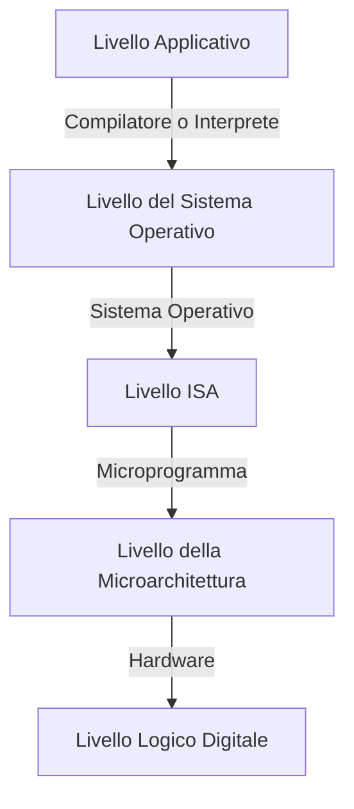

## Macchine a Più Livelli
---
> [!info] Linguaggio macchina ($L0$)
> Insieme di istruzioni che l'[[Definizioni_Architettura#Il Calcolatore|hardware]] è in grado di eseguire
> - Solitamente molto limitato
> - Poco adatto per i programmatori
>La limitatezza del linguaggio è dovuta a due fattori
>1. *Costo di realizzazione* dell'hardware, estremamente costoso
>2. *Complessità del calcolatore* cresce in modo più che proporzionale rispetto al linguaggio macchina

>Dato che scrivere programmi in linguaggio macchina $L0$, entra in gioco il concetto di macchina a più livelli

- Viene creato un nuovo linguaggio, un nuovo **livello** $L1$, più facile da utilizzare, che opera su un insieme di istruzioni eseguibili da un computer virtuale
	- Il *computer virtuale* in grado di "tradurre" il programma da livello $L1$ a $L0$
- Questa operazione si può ripetere diverse volte 

### Calcolatori Moderni
>I calcolatori moderni si basano su architetture a più livelli (normalmente 5)

#### Livelli
>[!tip] Application Level

Consiste in lunguaggi che possono essere utilizzati dai programmatori
- `Basic, Pascal, C, C++, etc`

>[!tip] Operating System Level

La macchina virtuale di questo livello ha un livello di astrazione simile a quella sottostante
- Istruzioni eseguibili uguali al livello ISA
- Vengono però fornite un insieme di funzionalità più sofisticate
	- Organizzazione della *memoria*
	- Esecuzione in ***parallelo*** dei programmi

>[!tip] ISA Level

Acronimo di `Instruction Set Architecture` questo livello definisce come il [[Definizioni_Architettura#Il Calcolatore|software]] controlla la `CPU`
> In generale l'ISA definisce le istruzioni, tipi di dato, registri e l'hardware supportato per gestire la memoria principale

- La complessità e il numero delle istruzioni presenti **variano da calcolatore a calcolatore**

>[!tip] Microarchitecture Level

Il livello della microarchitettura è un ulteriore livello di astrazione dove sono descritte le interazioni di tutte le unità funzionali

>[!tip] Digital Logic Level

Rappresenta l'hardware del calcolatore
- I suoi componenti dono detti porte o circuiti elementari
### Microprogrammazione
Il livello della **microprogrammazione** è stato introdotto per supportare un livello ISA complesso utilizzando un hardware *semplice*

> [!question] Microprogrammazione = Efficienza?

Nel corso degli anni la dimensione del microprogramma aumento sempre di più
- A causa dell'inserimento di istruzioni sempre più complesse e non supportabili dall'hardware
- Ad un certo punto la dimensione dei microprogrammi era tale da rallentare significativamente il funzionamento de calcolatori
	- Viene messa in discussione l'utilità del livello della microarchitettura

> [!done] Moderne architetture

Nelle moderne architetture i microprogrammi sono praticamente assenti
- Architetture **RISC**
	- `Reduced Instruction Set Computer`
		- Architettura del microprocessore che utilizza un ***basso numero di istruzioni altamente ottimizzate***, piuttosto che istruzioni altamente specifiche

### Sistema Operativo
Il livello del sistema operativo è stato introdotto per eliminare le fasi di inattività della `CPU` dovute all'input/output dei dati.
>[!example] Funzioni dell' `Operating System`
1. Gestione della `CPU`
	- Più processi possono essere eseguiti contemporaneamente sullo stesso sistema
	-  L'`OS` gestisce questa concorrenza (***time sharing***) in base alla priorità dei processi e al loro stato
2. Gestione della memoria
	- Permette a diversi processi di utilizzare la `RAM` in modo dinamico
3. Gestione delle periferiche
	- Permette ai diversi processi di utilizzare le risorse per l'`I/O` dei dati

### Virtualizzazione
Negli anni si iniziarono a diffondere tecnologie di virtualizzazione dell'hardware.
>[!question] Obbiettivo?

Con l'obbiettivo di rendere i sistemi operativi e software applicativo "**portabile**"
- Per potere eseguire lo stesso software su calcolatori con hardware e periferiche diversi
#### Tipi di Virtualizzazione
>[!example] Virtualizzazione dell'hardware
>Per potere ospitare sistemi operativi differenti in un unico calcolatore
>- Es. `VMware`

Il sistema operativo ospite (**guest**) può essere installato sopra al sistema operativo ospitante (**host**) oppure a partire da "bare-metal" (nessun ***host***)
- Si possono lanciare **più sistemi operativi contemporaneamente** e suddividere tra questi le risorse
>[!example] Macchine virtuali per software "portatile"
>Es. `Java` o `Microsoft .Net`

Il codice sorgente non è compilato direttamente in codice binario composto da istruzioni **ISA**
- Creato un **codice intermedio** indipendente dall'hardware
- Questo codice è compreso da una macchina virtuale (`Java Virtual Machine`) installata fra l'hardware e il sistema operativo
	- La macchina avrà il compito di tradurre il codice intermedio in codice ISA durante l'esecuzione
