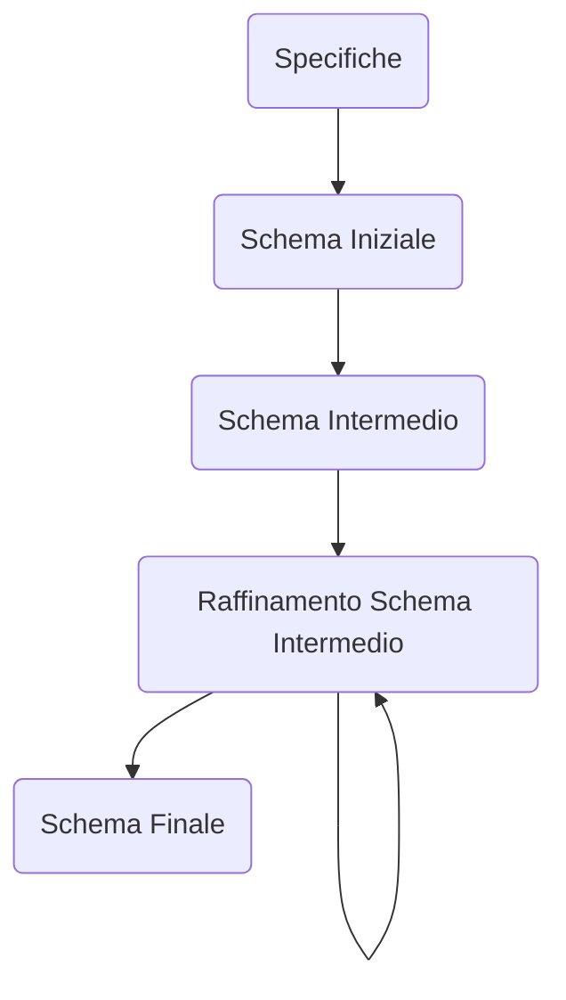
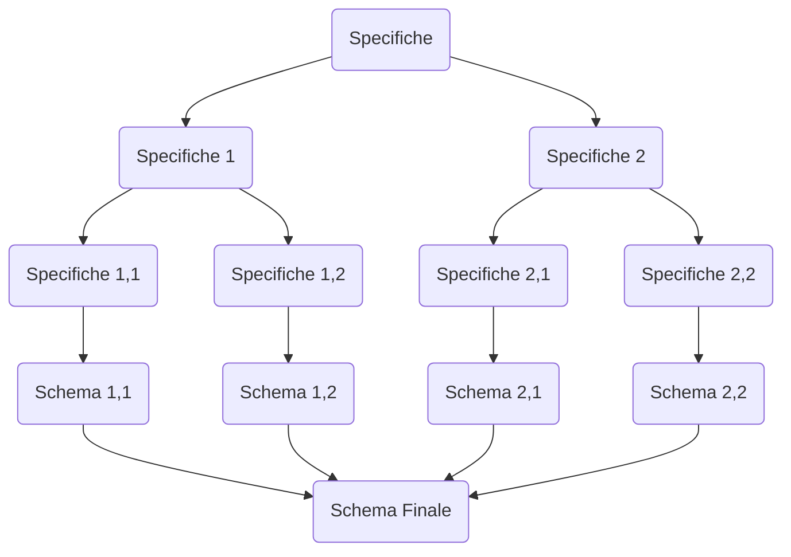

## Raccolta dei Requisiti
---
>Le fonti possono molto diversificate fra loro

- **Interviste** di Utenti
- **Documentazione** di varia natura

>[!note] Raccolta
>La raccolta dei requisiti è un'attività ***difficile e non standardizzabile***.
>Solitamente procede di pari passo con la *fase di analisi*.

### Regole Generali
#### Interazioni con gli utenti
>[!warning] Attenzione
>Interagire con gli utenti è una attività da considerare con attenzione
>- ***Utenti diversi*** possono fornire ***informazioni diverse***, con riferimento allo stesso tema.
>- Utenti a livello *più alto* hanno spesso una visione ***più ampia*** ma ***meno dettagliata***

>[!done] To Do:
>- Effettuare spesso ***verifiche di comprensione***.
>- Verificare anche per ***mezzo di esempi***.
>- Richiedere ***definizioni*** e ***classificazioni***.
>- Far evidenziare ***aspetti essenziali***.

### Documentazione Descrittiva
>Per evidenziare i concetti espressi nei requisiti è opportuno:
- Costruire una serie di frasi in ***linguaggio naturale*** e riorganizzarle per *concetti*.
- Descrivere ***Ipotesi aggiuntive*** non presenti nelle richieste.

>[!done] To Do:
>- Costruire un ***Glossario***/***Dizionario*** dei *dati*/*termini*.
>- Individuare *omonimi* e *sinonimi*, e ***unificare i termini***
>- Rendere esplicito il ***riferimento fra termini***

<table class="tg"><thead>
  <tr>
    <th class="tg-1wig">Termine</th>
    <th class="tg-1wig">Descrizione</th>
    <th class="tg-1wig">Sinonimi</th>
    <th class="tg-1wig">Collegamenti</th>
  </tr></thead>
<tbody>
  <tr>
    <td class="tg-0lax">Partecipante</td>
    <td class="tg-0lax">Persona che partecipa ai  corsi. Può essere un  dipendente o un libero  professionista.</td>
    <td class="tg-0lax">Studente</td>
    <td class="tg-0lax">Corso, Datore</td>
  </tr>
  <tr>
    <td class="tg-0lax">Docente</td>
    <td class="tg-0lax">Docente dei corsi. Può  essere un collaboratore  esterno</td>
    <td class="tg-0lax">Insegnante</td>
    <td class="tg-0lax">Corso</td>
  </tr>
  <tr>
    <td class="tg-0lax">Corso</td>
    <td class="tg-0lax">Corso organizzato dalla  società. Può avere più  edizioni</td>
    <td class="tg-0lax">Insegnamento</td>
    <td class="tg-0lax">Docente, Partecipante</td>
  </tr>
  <tr>
    <td class="tg-0lax">Datore</td>
    <td class="tg-0lax">Datore di lavoro attuale o  passato di un partecipante  ai corsi.</td>
    <td class="tg-0lax">Posto di Lavoro</td>
    <td class="tg-0lax">Partecipante</td>
  </tr>
</tbody></table>
- _Esempio di Glossario dei Termini_

>[!info] Tabella delle Operazioni
>Le *specifiche dei requisiti* riguardano anche le ***operazioni*** da effettuare sui dati e la ***frequenza*** con cui devono essere eseguite.

### Ristrutturazione dei Requisiti
>Per semplificare le analisi successive, è utile ***riformulare i requisiti***:

>[!example] Esempi
>- Eliminare le ***omonimie***
>- ***Riorganizzare le frasi*** raggruppandole in base al concetto a cui si riferiscono.
>	- Frasi di carattere *generale*
>	- Frasi riferite ad una *entità*

## Strategie di Progettazione
---
>Per affrontare progetti complessi è opportuno adottare un ***modo di procedere***, ovvero una strategia di progettazione

### Strategia Top-Down
>[!abstract] Concetto
>Nella ***strategia top-down*** si parte da uno schema iniziale molto *astratto ma completo*, che viene raffinato successivamente, fino ad arrivare allo ***schema finale***

>[!done] Pro
- Non è inizialmente necessario specificare i dettagli

>[!fail] Contro
- Richiede sin dall'inizio una visione globale del problema
### Strategia Bottom-Up
>[!tldr] Concetto
>Si ***suddividono le specifiche*** in modo da sviluppare semplici schemi parziali ma dettagliati, che poi vengono *integrati tra loro*.

>[!done] Pro
- Permette una ripartizione delle attività

>[!fail] Contro
- Richiede una fase d'integrazione
### Strategia Inside-Out
>[!caution] Concetto
>Lo schema si sviluppa “*a macchia d’olio*”, partendo dai concetti più importanti, aggiungendo quelli a essi correlati, e così via.

>[!done] Pro
- Non richiede passi di integrazione

>[!fail] Contro
- Richiede a ogni passo di esaminare tutte le specifiche per trovare i concetti non ancora rappresentati
