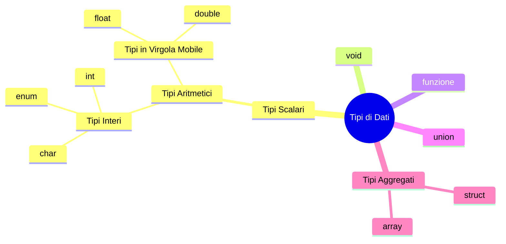

## ISO
---
>[!info] Descrizione
>La **International Organization for Standardization** è la più importante organizzazione a livello mondiale per la definizione di norme tecniche

## Precedenze e Associatività
---
| operatore              | Descrizione                             | Esempio            | Associatività | Precedenza |
| ---------------------- | --------------------------------------- | ------------------ | ------------- | ---------- |
| `++    --`             | Post incremento/decremento              | `x++` `x--`        | $\implies$    | 1          |
| `( )`                  | Chiamata a funzione                     | `x(y)`             | $\implies$    | 1          |
| `[ ]`                  | Elemento di un Array                    | `x[y]`             | $\implies$    | 1          |
| `.`                    | Membro di struttura o union             | `x.y`              | $\implies$    | 1          |
| `->`                   | Puntatore a membro di struttura         | `x->y`             | $\implies$    | 1          |
| `!`                    | Not Logico                              | `!x`               | $\impliedby$  | 2          |
| `~`                    | Complemento ad Uno                      | `~x`               | $\impliedby$  | 2          |
| `++   --`              | Pre incremento/decremento               | `++x  --x`         | $\impliedby$  | 2          |
| `+   -`                | Operatori unari di Segno                | `+x  -x`           | $\impliedby$  | 2          |
| `&`                    | Operatore di Indirizzo                  | `&x`               | $\impliedby$  | 2          |
| `*`                    | Operazione di Dereferenziazione         | `*x`               | $\impliedby$  | 2          |
| `(type)`               | Operatore di conversione di Tipo (Cast) | `(int)x`           | $\impliedby$  | 2          |
| `sizeof`               | Dimensione in Byte                      | `sizeof(x)`        | $\impliedby$  | 2          |
| `*`                    | Moltiplicazione                         | `x * y`            | $\implies$    | 3          |
| `/`                    | Divisione                               | `x / y`            | $\implies$    | 3          |
| `%`                    | Resto della Divisione Intera            | `x % y`            | $\implies$    | 3          |
| `+`                    | Somma                                   | `x + y`            | $\implies$    | 4          |
| `-`                    | Differenza                              | `x - y`            | $\implies$    | 4          |
| `<<`                   | Left Shift                              | `x << y`           | $\implies$    | 5          |
| `>>`                   | Right Shift                             | `x >> y`           | $\implies$    | 5          |
| `<`                    | Minore                                  | `x < y`            | $\implies$    | 6          |
| `<=`                   | Minore Uguale                           | `x <= y`           | $\implies$    | 6          |
| `>`                    | Maggiore                                | `x > y`            | $\implies$    | 6          |
| `>=`                   | Maggiore Uguale                         | `x >= y`           | $\implies$    | 6          |
| `==`                   | Ugualianza                              | `x == y`           | $\implies$    | 7          |
| `!=`                   | Non Ugualianza                          | `x != y`           | $\implies$    | 7          |
| `&`                    | _Bitwise_  AND                          | `x & y`            | $\implies$    | 8          |
| `^`                    | _Bitwise_  XOR                          | `x ^ y`            | $\implies$    | 9          |
| <code>\|</code>                    | _Bitwise_  OR                           | <code>x \| y</code>            | $\implies$    | 10         |
| `&&`                   | AND Logico                              | `x && y`           | $\implies$    | 11         |
| <code>\|\|</code>                  | OR Logico                               | <code>x \|\| y</code>           | $\implies$    | 12         |
| `? :`                  | Operatore Condizionale                  | `x ? y : z`        | $\impliedby$  | 13         |
| `=`                    | Assegnamento                            | `x = y`            | $\impliedby$  | 14         |
| `*=  /=  %=  +=  -=`   | Assegnamenti Composti                   | `x <op>= y` | $\impliedby$  | 14         |
| `<<=  <<=  &=  \|=  ^=` | Assegnamenti Composti                   | `x <op>= y` | $\impliedby$  | 14         |
| `,`                    | Operatore di Concatenazione             | `x, y`             | $\implies$    | 15           |

## Passaggio per Valore e per Riferimento
---
>[!info] Passaggio per Valore
>Nel passaggio per valore, il valore di una variabile viene **copiato e passato** alla funzione. Ciò significa che la funzione riceve una **copia del valore originale** e **non può modificarlo**. Qualsiasi modifica effettuata all'interno della funzione rimarrà **confinata alla copia locale** della variabile e non influenzerà la variabile originale nell'ambito chiamante

>[!info] Passaggio per Riferimento
>Il passaggio per **riferimento** si riferisce alla modalità con cui le funzioni accedono ai parametri attraverso un **riferimento** (o **puntatore**) alla **variabile originale**, piuttosto che attraverso una copia del valore

## Classificazione dei Tipi di Dati in C
---
