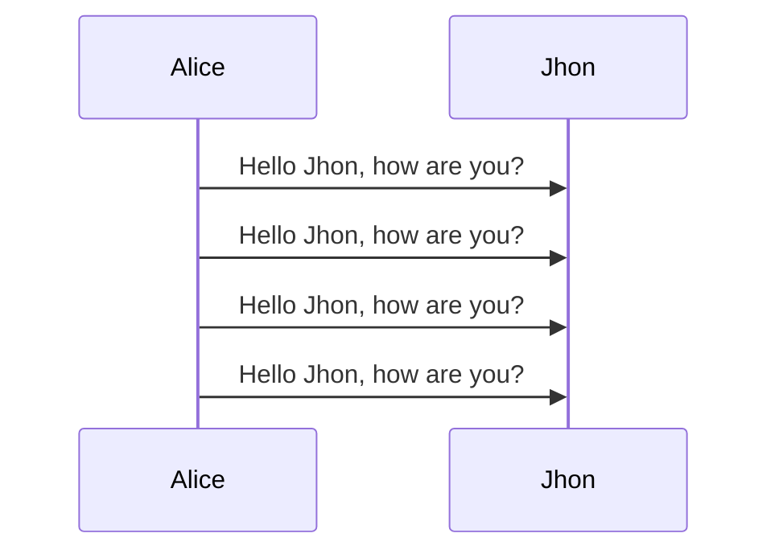

# Titoli
## Titoli
### Titoli
#### Titoli
##### Titoli
###### Titoli
Cancelletti da 1 a 6 per grandezze differenti

```js title:"Code Injection corso sulla sicurezza"
var nextBtn = document.getElementById("next")
nextBtn
setInterval(function(){nextBtn.click()},300)
```
globalspeed
#### Callouts

>[!tldr] Cose
>>[!todo] Sotto cose

\>\[!tldr\] Cose
\>\[!info\]Sotto cose

##### Tutti i callouts:
- !tldr
- !info
- !todo
- !tip
- !done
- !faq
- !warning
- !error
- !bug
- !example
- !quote

\[\[Analisi]]
Links
Doppia quadra  => [[README]]

The tag.

*Italics*
Asterisco

**Bold**
Doppio asterisco

~~Strikethrough~~
Doppia Tilde

Lists
- trattino singolo
- ok
	- tab
inizia con 1.
1. anche numeri
	1. 1
	2. 2
2. eh si

- [ ] checkbox

\ - [ ] titolo checkbox

Code snippets
``` js
while(true){
	console.log("triplo apice => ``` ")
}
```
## Mermaid diagrams
---



Blockquotes
aggiungi un > davanti al paragrafo

> Asta la vista, *** Camionista

possibile fare anche innestati
>Asd
>>Sus

linee separazione (\*\ * \*) (- - -) (\_ \_ \_)
in una linea da soli 


- - -
# Latex formulas
shft+B => underset
doppio dollaro per aprire chiudere
$$x^n + y^n = z^n$$
\\displaystyle{ argomenti } 
- display go brrr

Spaces
- `\;` - a thick space
- `\:` - a medium space
- `\,` - a thin space
- `\!` - a negative thin space

- radici
	- \\sqrt{ * **formula** * }
	- \sqrt \[radicando] {* **formula** * }
		- $\sqrt[2]{12}$
- frazioni
	- \\frac{* **numeratore** * }{* **denominatore** * }
		- $\frac{1}{2}$
		- displaystyle
			-  $\displaystyle{\frac{1}{2}}$
	- semplici frazioni
		- $ 2/3 $ 
			- $2/3$ 
nun se sa mai
><font color="CornflowerBlue">$f(x) = x$ </font>
><font color="red">$f(x) = x$ </font>
><font color="green">$f(x)= x$</font>

caratteri speciali
![[GreekLetters.png]]

![[Arrows.png]]

![[Relation operators.png]]

![[Relation Operators 2.png]]

![[Binary Operators.png]]

![[Negated Binary Relations.png]]

![[Geometry.png]]

![[Set Notation.png]]

![[Miscellaneous Symbols.png]]
