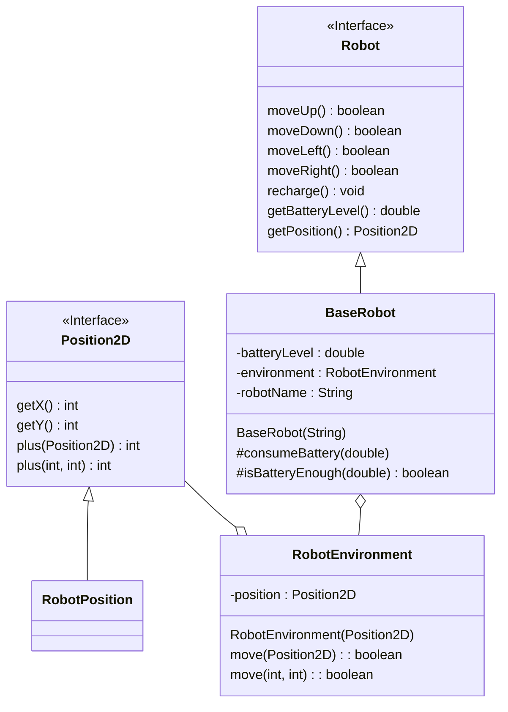
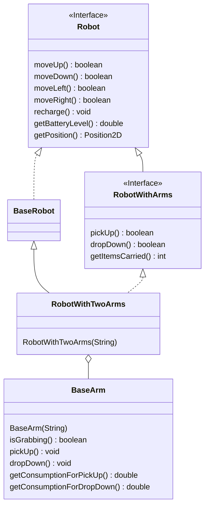

## Compilazione
---
Nome del file uguale al nome della classe $\to$ `ClassName.java`

java versione 21

Entra nel cmd nella directory corretta
``` bash
javac ClassName.java
//file compilato (ClassName.class)
java ClassName
```

jvm Cerca il metodo main all'interno di `ClassName` e se lo trova lo esegue

Se devi compilare una cartella intera:
``` bash
javac *.java
```



