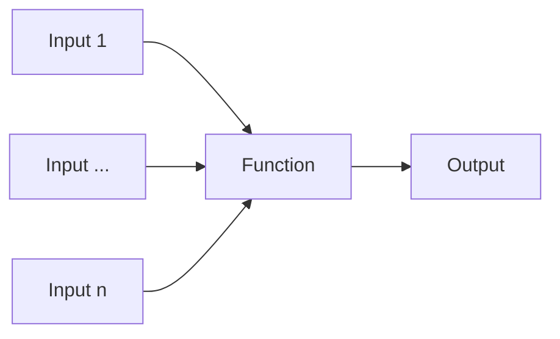

## Funzioni
---
>[!info] Definizione
>Una **funzione** è un particolare costrutto sintattico che permette di definire un blocco di codice che assolve un compito ben preciso
>Le funzioni permettono di scomporre un **problema complesso** in moduli più semplici
>>[!example] Sinonimi
>>1. Procedura
>>2. Routine
>>3. Subroutine
>>4. Sottoprogramma

- Possiamo vedere una funzione come una **black box**, che prende in ingresso alcuni valori e produce in output un valore

- Esistono funzioni che non prendono nessun **valore in ingresso** e/o che non producono alcun **valore di uscita**
- Se implementate correttamente, possono essere **riutilizzate** per la risoluzione di problemi differenti