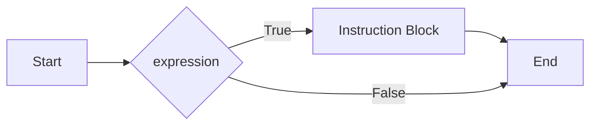
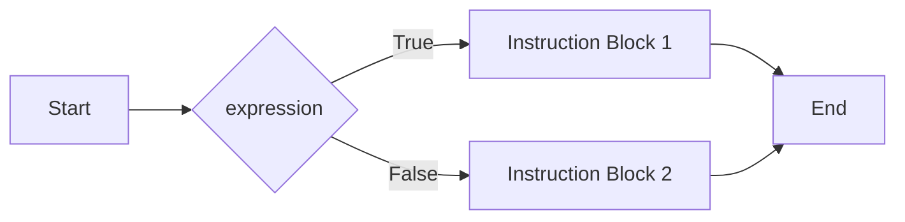

## Strutture Condizionali
---
>[!info] Definizione
>Le **Strutture condizionali** permettono di specificare due rami o [[Sequenziali|blocchi]] di codice, di cui solo uno verrà eseguito in base al **risultato booleano** di una specifica [[Intro Espressioni e Operatori#Espressioni e Operatori|espressione]] condizionale (***vero/falso***)

### Costrutto `if`
>[!tldr]
>Il costrutto `if` realizza un'istruzione di **salto condizionale**

```c
if(<expression>){
	<Istruction Block>
}
```


- Se l'espressione `<espression>` è **vera** allora si esegue il blocco di istruzioni definito in `<Instruction Block>`, altrimenti si prosegue con l'elaborazione della riga successiva

### Costrutto `if-else`
>[!tldr]
>Il costrutto `if-else` esegue un blocco di istruzioni se l'espressione è vera, ne esegue un altra **altrimenti**

```c
if(<expression>){
	<Instruction Block 1>
}else
{
	<Instruction Block 2>
}
```


- Le istruzioni in `Instruction Block 1` sono eseguite solo se l'espressione in `espression` è **vera**
- In caso contrario, sono eseguite le istruzioni in `Instruction Block 2`

### Costrutto `switch`
>[!tldr]
>Il costrutto `switch` realizza un'istruzione di **scelta multipla**

```c
switch(<int expression>){
	case <int-const1>: <Instruction Block1> [break;]
	case <int-const2>: <Instruction Block2> [break;]
	case <int-const3>: <Instruction Block3> [break;]
	...
	default: <Default Instruction Block> [break;]
}
```

- Se il valore della `<int expression>` coincide con il valore specificato in uno dei vari `case` il blocco di istruzioni corrispondente viene eseguito
- L'istruzione `default` (opzionale) viene eseguita se gli altri `case` non sono soddisfatti