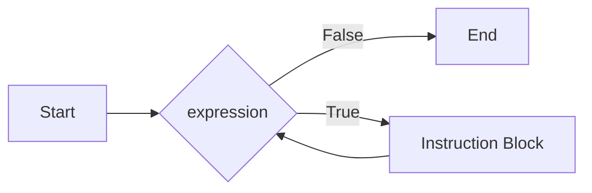
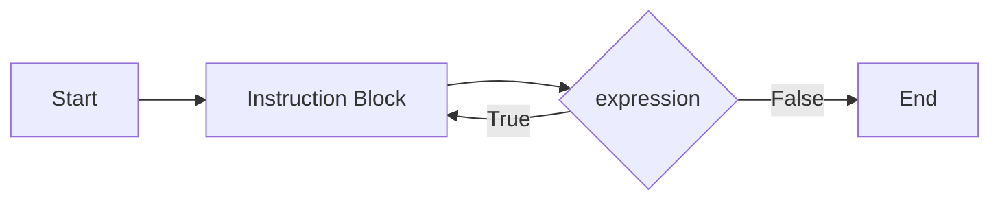

## Strutture Iterative
---
>[!info] Definizione
>Le strutture di controllo **Iterative** permettono di specificare che un dato blocco di istruzioni sia eseguito **ripetutamente**, fintanto che determinate **condizioni di permanenza nel ciclo** siano soddisfatte

- Un linguaggio che ammette unicamente strutture sequenziali e condizionali ha un potere espressivo **limitato**
- È importante riconoscere **l'equivalenza** tra i costrutti iterativi
	- Un codice sorgente scritto con un qualsiasi costrutto iterativo si può traaformare per avere lo stesso risultato con un altro costrutto iterativo
### Costrutto `for`
>[!tldr]
>Il costrutto `for` serve per realizzare un **loop**, cioè l'esecuzione dello stesso insieme di istruzioni per un certo numero di volte.

```c
for(<expr1>;<expr2>;<expr3>){
	<Instruction Block>
}
```


Il costrutto `for` è composto da 3 parti
#### Inizializzazione
- Prima di iniziare il ciclo, viene valutata una sola volta `expr1`

#### Test
- L'espressione `expr2` è una **condizione di permanenza** nel ciclo
	- Le istruzioni nell'`Instruction Block` sono eseguite solo se `expr2` è vera
	- Diversamente il ciclo termina

#### Incremento
- L'espressione `expr3` viene valutata al termine di **ogni iterazione** dopo aver eseguito le istruzioni nell'`Instruction Block`

### Costrutto `while`
>[!tldr]
>Il costrutto `while` come il costrutto `for` server per realizzare un **ciclo**

```c
while(<expression>){
	<Instruction Block>
}
```


- Le istruzioni nell'`istruction Block` sono eseguite fintanto che `expression` è vera
- L'espressione `expression` viene valutata prima di eseguire le istruzioni nel blocco
	- L'`Instruction Block` quindi potrebbe non essere mai eseguito
### Costrutto `do-while`

>[!tldr]
>Il costrutto `do-while` come i costrutti `for` e `while`, serve per realizzare un **ciclo**

```c
do{
	<Instruction Block>
}while(<expression>);
```


- A differenza del costrutto `while`, l' `Instruction Bloc` viene eseguito sempre almeno una volta
	- Importante notare il `;` dopo il `while`