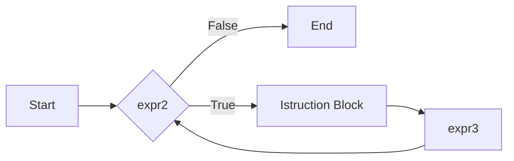

## Strutture Iterative
---
>[!info] Definizione
>Le strutture di controllo **Iterative** permettono di specificare che un dato blocco di istruzioni sia eseguito **ripetutamente**, fintanto che determinate **condizioni di permanenza nel ciclo** siano soddisfatte

- Un linguaggio che ammette unicamente strutture sequenziali e condizionali ha un potere espressivo **limitato**

### Costrutto `for`
>[!tldr]
>Il costrutto `for` serve per realizzare un **loop**, cioè l'esecuzione dello stesso insieme di istruzioni per un certo numero di volte.

```c
for(<expr1>;<expr2>;<expr3>){
	<Istruction Block>
}
```



Il costrutto `for` è composto da 3 parti
#### Inizializzazione
- Prima di iniziare il ciclo, viene valutata una sola volta `expr1`

#### Test
- L'espressione `expr2` è una **condizione di permanenza** nel ciclo
	- Le istruzioni nell'`Istruction Block` sono eseguite solo se `expr2` è vera
	- Diversamente il ciclo termina

#### Incremento
- L'espressione `expr3` viene valutata al termine di **ogni iterazione** dopo aver eseguito le istruzioni nell'`Istruction Block`

### Costrutto `while`


### Costrutto `do-while`