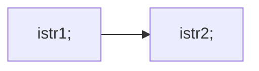

## Le Strutture Sequenziali
---
>[!info] Definizione
>Blocchi di codice le cui istruzioni vengono eseguite nella stessa sequenza in cui sono organizzate nel codice sorgente.
>I blocchi di codice possono contenere strutture [[Condizionali]] e/o [[Iterative]]

- Sequenza di istruzioni racchiuse tra parentesi graffe(**Blocco di Istruzioni**)
```c
{
	<istr1>;
	<istr2>;
	...
}
```


- Ogni istruzione è terminata da un **punto e virgola**
- Le istruzioni in sequenza vengono eseguite una di seguito all'altra
	- Non è possibile eseguire due istruzioni **contemporaneamente**
- All'interno di un blocco è possibile inserire istruzioni o ***annidare*** altri blocchi
