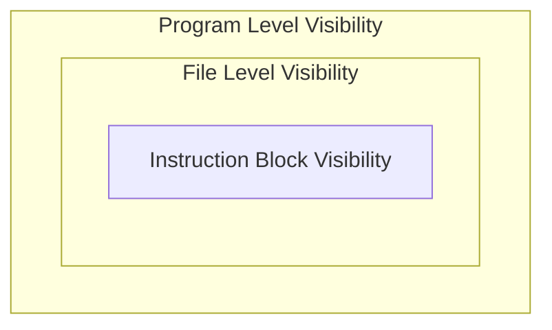

## Visibilità
---
>[!info] Definizione
>La **visibilità** o **scope** è una porzione di programma in cui il dato è noto e può essere quindi utilizzato
>>[!warning]
>>I campi di visibilità si applicano a tutti gli identificatori non solo alle  [[Introduzione Variabili|variabili]] 

- Ogni dichiarazione di variabile nel linguaggio C ha un ***campo di visibilità*** o ***scope***
- Una variabile può essere **referenziata** unicamente nella regione di programma in cui è **visibile**
	- In **scope** distinti due variabili con lo stesso nome **non sono correlate**

In C la gerarchia di visibilità è la seguente

- Il campo di visibilità dipende principalmente dalla posizione della [[Introduzione Variabili#Dichiarazione|dichiarazione]] 
	Gli [[Linguaggio C#Keywords|specificatori di classe]] di memorizzazione sono `extern` e `static` ci permettono di *alterare* la visibilità di variabili e [[Funzioni in C|funzioni]]
### Variabili "Globali"
>[!tldr]
>Variabili dichiarate al di fuori di ogni funzione sono dette **Variabili Globali**
>Esse sono visibili, e quindi possono essere usate, da tutte le funzioni all'interno dello stesso file

```c
#include<stdio.h>
int count = 0;

void set ( int x) { count =x; }

int lesseq ( int x) { return count <=x; }

void incr ( void ) { ++ count ; }
int main () {
	for ( set (1); lesseq (1000); incr ())
		printf ("%d\n",count );
	return 0;
	
}
```
- Possiamo usare le variabili globali come *memoria condivisa* tra funzioni

### Variabili "Locali"
>[!tldr]
>Le variabili a **livello di blocco**, dette "*locali*" o "*automatiche*" sono dichiarate in un blocco
>>[!done] Uso
>>Sono visibili e possono essere usate solo nel blocco in cui sono state dichiarate

- Una variabile locale "*maschera*" le variabili con lo stesso nome esterne al blocco
```c
#include<stdio.h>

int count = 0;

//Does nothing
void set(int x){
	int count = 0; //Different from the global count
	count = x;
}
```
- La dichiarazione della variabile `count` nell'esempio maschera la variabile locale
	- Il riferimento a `count` è un riferimento alla variabile locale

### Riassunto
- Variabili: 
	- Una variabile globale è visibile a livello di programma. 
	- Una variabile globale static è visibile solo a livello di file.
	- Una variabile locale è visibile solo nel blocco in cui è stata dichiarata.
- Funzioni
	- Una funzione è visibile alle funzioni che seguono la sua dichiarazione/definizione.
	- Una funzione nello stesso programma può essere invocata anche se non visibile, a patto che il suo tipo di ritorno sia int (sintassi K&R).
	- Una funzione static è visibile solo a livello di file.

## Tempo di Vita
---
>[!info] Definizione
>Il **tempo di vita** di una variabile indica l'intervallo di tempo in cui esiste un'area di memoria associata alla variabile
>Esistono due classi di **storage duration**
>>[!example] `static`
>>Il tempo di vita si estende per tutta la durata del programma
>
>>[!example] `automatic` 
>>- Il tempo di vita è legato all'ambito di visibilità locale della variabile

- Dal punto di vista delle variabili, abbiamo:
	- Variabile locale (tempo di vita **automatic** o **static**).
		- Viene creata al momento della dichiarazione.
		- Viene distrutta non appena termina il blocco in cui è stata **dichiarata**.
		- È possibile **modificare** il tempo di vita della variabile locale da **automatic** a **static** facendo uso dello specificatore `static`.
	- Variabile globale (tempo di vita static).
		- Viene creata **prima di iniziare** l’esecuzione del programma.
		- Il suo tempo di vita si estende per **tutta la durata del programma**.

## Keywords
#### Keyword `extern`
La parola chiave `extern` permette di rendere visibile all'interno di un file, una funzione o una variabile globale definite **in qualche altro punto del programma**
```c
extern int x;
```
- La dichiarazione `extern` non causa *allocazione di memoria* per la variabile `x`
- Indica che ogni riferimento alla variabile `x` nello scope locale è un riferimento ad una variabile globale definita in qualche altro punto del programma

#### Keyword `static`
La parola chiave `static` permette di **modificare la *visibilità*** di dichiarazioni di variabili globali e funzioni.
- Le variabili globali e le funzioni `static` sono visibili unicamente a livello di file
- Le variabili `static` se non esplicitamente inizializzate, sono implicitamente inizializzate a $0$, o più precisamente, tutti i `bit` della locazione di memoria sono inizializzati a $0$

Se utilizzata con variabili **locali**, istruisce il compilatore di **mantenere in vita la variabile** per l'intera durata del programma
- Anche quando il blocco in cui è dichiarata **termina**

```c
int myRand(){
	static int seed = 1;
	return seed = (5 * seed + 3) % 16;
}
```
- La variabile `seed` nella funzione `myRand()` viene inizializzata solo alla **prima chiamata**